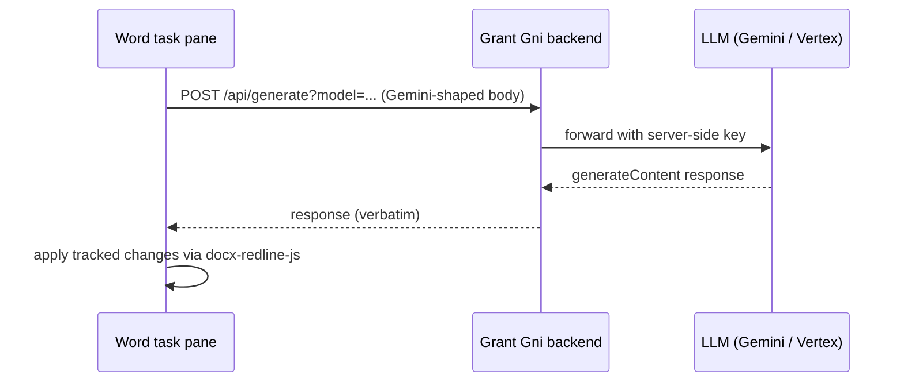
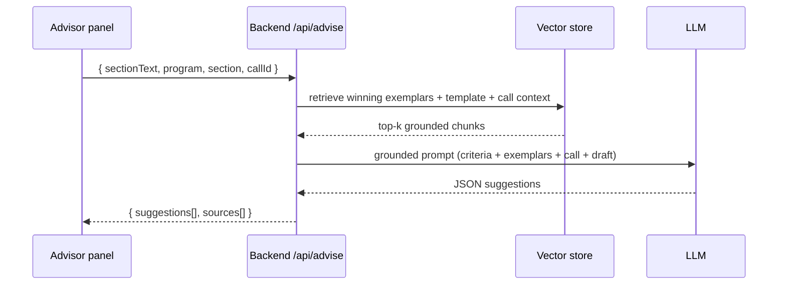
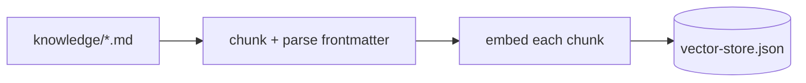
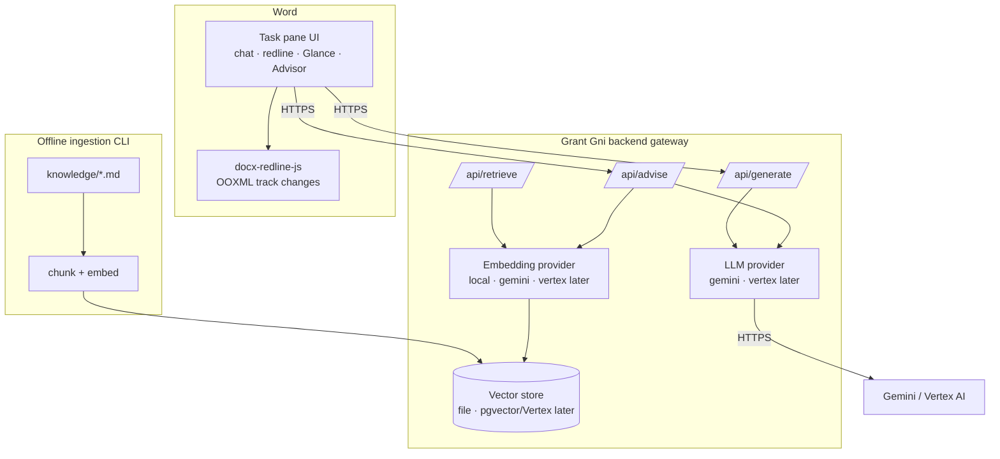

# Grant Gni — Project Documentation

> Grant Gni is an AI grant-writing assistant that lives inside Microsoft Word. It
> drafts, edits, and reviews funding proposals, and gives **grounded, evaluator-style
> advice** based on winning proposals, program templates, and the strategic intent of
> the specific call you are applying to.

This document is the single source of truth for how the system works, how to install,
run, update, and deploy it (locally and in the cloud), and the trade-offs between a
Cloudflare and a GCP deployment. It is written to be uploaded to GitHub as-is.

---

## Table of contents

1. [What Grant Gni is](#1-what-grant-gni-is)
2. [How the system works](#2-how-the-system-works)
3. [Workflow & data flow](#3-workflow--data-flow)
4. [Architecture](#4-architecture)
5. [Repository structure](#5-repository-structure)
6. [Installation](#6-installation)
7. [Running locally](#7-running-locally)
8. [Configuration reference](#8-configuration-reference)
9. [The knowledge layer (RAG, templates, call context)](#9-the-knowledge-layer-rag-templates-call-context)
10. [Backend API reference](#10-backend-api-reference)
11. [Updating the system](#11-updating-the-system)
12. [Deployment: overview](#12-deployment-overview)
13. [Deployment: GCP](#13-deployment-gcp)
14. [Deployment: Cloudflare](#14-deployment-cloudflare)
15. [Cloudflare vs GCP — comparison](#15-cloudflare-vs-gcp--comparison)
16. [Publishing the add-in (Microsoft Marketplace)](#16-publishing-the-add-in-microsoft-marketplace)
17. [Security, privacy & compliance](#17-security-privacy--compliance)
18. [Roadmap & monetization](#18-roadmap--monetization)
19. [Troubleshooting](#19-troubleshooting)
20. [Glossary](#20-glossary)

---

## 1. What Grant Gni is

Grant Gni is a **Microsoft Word add-in** plus a **backend gateway**. Originally the
project was a "bring your own key" (BYOK) Gemini add-in where each user pasted their
own Google API key into the task pane and the add-in called Google directly. It has
been re-architected into a product:

- The add-in **no longer holds any AI key**. All AI traffic goes through the Grant Gni
  backend, which holds the provider key server-side.
- It is **rebranded to Grant Gni**.
- It has a **knowledge layer**: an Advisor that grounds its suggestions in a corpus of
  winning proposals, the relevant program template, and the active call's context.

The underlying document-editing engine (track-changes / redline generation via pure
OOXML) is provided by the external package `@ansonlai/docx-redline-js` and is a strong,
reusable asset that is kept intact.

### Current status

| Capability | Status |
|---|---|
| Backend gateway (proxy LLM calls) | ✅ Built & tested |
| Add-in repointed to backend, BYOK removed | ✅ Built |
| Rebrand to Grant Gni | ✅ Built |
| Knowledge layer: ingestion, embeddings, vector store | ✅ Built & tested |
| `/api/retrieve`, `/api/advise` endpoints | ✅ Built & tested |
| Advisor panel in the add-in | ✅ Built |
| Excel budget/resource add-in | ⛔ Planned |
| Usage analytics (MLflow-style) | ⛔ Planned |
| Auth + subscriptions (monetization) | ⛔ Planned (intentionally last) |

> The knowledge corpus currently shipped is **synthetic placeholder content** for
> Horizon Europe so the whole pipeline runs today. Real (consented) proposals and
> templates replace it later — see [section 9](#9-the-knowledge-layer-rag-templates-call-context).

---

## 2. How the system works

There are two runtime pieces and one build-time pipeline.

**1. The Word add-in (frontend).** A task pane (HTML/CSS/JS, bundled by webpack) that
runs inside Word via Office.js. It provides the chat, the redline/edit tools, the
"Glance" checks, and the **Advisor** panel. It calls the backend over HTTPS. It stores
only non-secret preferences (model choice, system message, redline settings) in the
browser `localStorage`.

**2. The backend gateway (server).** A Node/Express service. It:
- holds the LLM provider key and forwards generation requests (`/api/generate`);
- runs the knowledge retrieval and the Advisor (`/api/retrieve`, `/api/advise`);
- is the single place where authentication, subscription/quota checks, usage logging,
  and a switch to Vertex AI will later be added.

**3. The ingestion pipeline (offline).** A CLI (`npm run ingest`) that reads the
knowledge corpus (markdown), splits it into chunks, turns each chunk into an embedding
vector, and writes them to a vector store. Retrieval at request time embeds the query
the same way and finds the closest chunks.

The key design principle is **swappability**: the LLM provider, the embedding provider,
and the vector store all sit behind small interfaces so they can be replaced (e.g.,
Gemini → Vertex AI; file store → pgvector/Vertex Vector Search/Cloudflare Vectorize)
without touching the rest of the system.

---

## 3. Workflow & data flow

### User workflow

1. The grant writer opens their proposal in Word and opens the **Grant Gni** task pane.
2. They **chat** with Grant Gni or use the **redline tool** to draft and edit. These go
   through the backend to the LLM and come back as tracked changes.
3. They open the **★ Advisor**, choose the program (e.g., Horizon Europe), optionally a
   section and a call ID, select the text to review (or review the whole document), and
   click **Get advice**.
4. The Advisor returns specific, prioritized suggestions, each labelled with the source
   it was grounded in (a template criterion, a winning-proposal exemplar, or the call's
   strategic framing).

### Request flow — chat / redline



### Request flow — Advisor (RAG)



### Ingestion flow (offline)



---

## 4. Architecture



**Boundaries that matter:**

- The add-in only ever talks to the backend (never to Google directly).
- All document-shaping logic stays in `@ansonlai/docx-redline-js`; the add-in layer is
  a thin orchestration layer (this is a long-standing principle of the codebase, see
  `SPEC.md`/`ARCHITECTURE.md`).
- The backend is where every cross-cutting concern (auth, billing, logging, provider
  choice, vector store choice) is centralized.

---

## 5. Repository structure

```
grant-gni/
├── manifest.xml                  # Office add-in manifest (Grant Gni, v1.3.0.0)
├── package.json                  # Add-in build (webpack) + scripts
├── webpack.config.js
├── DOCUMENTATION.md              # ← this file
├── V1_SETUP.md                   # Quick start for the gateway/rebrand stage
├── V2_KNOWLEDGE_SETUP.md         # Quick start for the knowledge layer
├── SPEC.md / ARCHITECTURE.md / ROADMAP.md / STATE.md / SUMMARY.md   # GSD docs
│
├── src/                          # The Word add-in (frontend)
│   ├── taskpane/
│   │   ├── taskpane.html         # UI incl. Advisor view + ★ button
│   │   ├── taskpane.js           # Core: backend URL helper, chat, redline, init
│   │   ├── taskpane.css
│   │   └── modules/
│   │       ├── advisor/advisor-panel.js     # Advisor panel logic
│   │       ├── commands/agentic-tools.js    # Tool calls (repointed to backend)
│   │       ├── chat/ · utils/ · docx-redline-js-integration/
│   └── commands/
│
├── backend/                      # The Grant Gni backend gateway (Node/Express)
│   ├── package.json              # start / dev / ingest scripts
│   ├── .env.example              # Configuration template (copy to .env)
│   ├── src/
│   │   ├── server.js             # Express app + endpoints + HTTPS boot
│   │   ├── providers/gemini.js   # LLM provider (swap to vertex later)
│   │   └── knowledge/
│   │       ├── embeddings.js     # local + gemini embedding providers
│   │       ├── vector-store.js   # FileVectorStore (swap to pgvector/Vertex/Vectorize)
│   │       ├── chunk.js          # markdown chunking + frontmatter
│   │       ├── ingest.js         # ingestion CLI (npm run ingest)
│   │       ├── retriever.js      # query-time retrieval
│   │       └── advisor.js        # grounded suggestion generation
│   ├── knowledge/horizon-europe/ # synthetic corpus (template, call, winning excerpts)
│   └── data/vector-store.json    # generated by ingestion (git-ignored in prod)
│
├── browser-demo/                 # Standalone web demo of the redline engine
├── mcp/docx-server/              # MCP server exposing the redline engine
└── tests/
```

---

## 6. Installation

### Prerequisites

- **Node.js 18+** (the add-in build and the backend both use it).
- **Microsoft Word** (desktop recommended) with an Office account that allows sideloading.
- A **Google Gemini API key** for the backend — <https://aistudio.google.com/app/apikey>.
  (This is the only secret you need for local development.)

### Clone

```bash
git clone <your-repo-url> grant-gni
cd grant-gni
```

### Install the add-in build tooling

```bash
npm install
npx office-addin-dev-certs install   # trusted localhost HTTPS certs (once)
```

`office-addin-dev-certs install` writes certs to your user profile, typically:

```
C:\Users\<you>\.office-addin-dev-certs\localhost.crt
C:\Users\<you>\.office-addin-dev-certs\localhost.key
```

Note these two paths — the backend uses them so it can serve HTTPS (required, see below).

### Install the backend

```bash
cd backend
npm install
cp .env.example .env        # Windows: copy .env.example .env
```

Edit `backend/.env`:

- `GEMINI_API_KEY=` → your key.
- `SSL_CERT_PATH=` / `SSL_KEY_PATH=` → the two cert paths above.
- For first-run, `EMBED_PROVIDER=local` works with no extra setup; switch to `gemini`
  for real semantic quality (then re-ingest).

> **Why HTTPS locally?** The task pane is served over HTTPS. Browsers block an HTTPS
> page from calling an HTTP endpoint ("mixed content"), so the backend must also be
> HTTPS in local development. If the cert paths are missing the backend falls back to
> HTTP and the add-in won't be able to reach it.

---

## 7. Running locally

You run **two** dev servers.

**Terminal 1 — backend:**

```bash
cd backend
npm run ingest      # build the vector store from the knowledge corpus (first time)
npm start           # https://localhost:3001
```

Healthcheck:

```bash
curl -k https://localhost:3001/health
# {"ok":true,...,"providerConfigured":true,"knowledge":{"size":16,...}}
```

**Terminal 2 — add-in:**

```bash
# from the project root
npm start           # builds, serves on https://localhost:3000, sideloads Word
```

Then in Word: open **Grant Gni** (Home tab → Assistant). Test the chat, an edit
(should appear as a tracked change), and the **★ Advisor**.

### Pointing the add-in at a non-default backend

The add-in defaults to `https://localhost:3001`. To override (e.g., a deployed
backend), open the task pane's dev console (F12) and run:

```js
localStorage.setItem("grantGniBackendUrl", "https://api.your-domain.com");
```

When you deploy, also add that domain to `<AppDomains>` in `manifest.xml`.

---

## 8. Configuration reference

All backend config lives in `backend/.env` (never committed). Keys:

| Variable | Default | Purpose |
|---|---|---|
| `PORT` | `3001` | Port the backend listens on. |
| `USE_HTTPS` | `true` | Serve HTTPS locally (needed for the task pane). |
| `SSL_CERT_PATH` | — | Path to PEM cert (from `office-addin-dev-certs`). |
| `SSL_KEY_PATH` | — | Path to PEM key. |
| `ALLOWED_ORIGINS` | `https://localhost:3000` | Comma-separated CORS allow-list (add your deployed frontend origin in prod). |
| `LLM_PROVIDER` | `gemini` | Which LLM provider to use (`vertex` later). |
| `GEMINI_API_KEY` | — | Server-side Gemini key. |
| `GEMINI_API_BASE` | `…/v1beta` | Override Gemini API base if needed. |
| `EMBED_PROVIDER` | `local` | `local` (offline) or `gemini` (semantic). |
| `EMBED_MODEL` | `text-embedding-004` | Embedding model when `EMBED_PROVIDER=gemini`. |
| `ADVISOR_MODEL` | `gemini-flash-latest` | Model the Advisor uses to produce suggestions. |

Add-in config: the only runtime knob is `localStorage["grantGniBackendUrl"]`; default
is `https://localhost:3001` (see `getBackendBaseUrl()` in `taskpane.js`).

---

## 9. The knowledge layer (RAG, templates, call context)

### Concepts

The corpus is a set of markdown files under `backend/knowledge/<program>/`. Each file
begins with frontmatter that tags it:

```markdown
---
program: horizon-europe
docType: winning-proposal     # or: template | call
section: excellence           # excellence | impact | implementation (optional)
callId: HORIZON-CL5-2026-...   # for docType: call (optional)
title: "..."
source: "internal-ref"
---
# Heading
Body text…
```

- **`template`** — the program's application structure and evaluation criteria.
- **`call`** — a specific funding call's expected outcomes, scope, and strategic intent.
- **`winning-proposal`** — exemplar passages from funded proposals.

### Pipeline

1. **Chunk** (`chunk.js`): split each file on headings (max ~1200 chars), carrying
   frontmatter + nearest `[section: …]` tag onto every chunk.
2. **Embed** (`embeddings.js`): turn each chunk into a vector.
   - `local`: deterministic feature-hashing (256-dim), offline, no key — for dev/testing.
   - `gemini`: `text-embedding-004` (768-dim) — for real semantic retrieval.
3. **Store** (`vector-store.js`): write `{vector, text, metadata}` records to
   `backend/data/vector-store.json`.
4. **Retrieve** (`retriever.js`): embed the query, cosine-rank, filter by metadata
   (program / docType / section / callId), return top-k.
5. **Advise** (`advisor.js`): gather winning exemplars + template criteria + call
   context, build a grounded evaluator prompt, call the LLM, return structured JSON.

### Commands

```bash
cd backend
npm run ingest            # (re)build the vector store
```

Re-run ingestion whenever you change the corpus **or** switch `EMBED_PROVIDER` (query
and stored vectors must come from the same provider).

### Replacing synthetic content with real material

Drop real files into `backend/knowledge/horizon-europe/` (or new `backend/knowledge/<program>/`
folders) using the frontmatter above, then `npm run ingest`. **Only ingest documents
you have the rights/consent to use** (see [section 17](#17-security-privacy--compliance)).

### Swapping the vector store for cloud

`FileVectorStore` is fine for development and single-instance deployments. For
serverless/multi-instance cloud, implement the same `load/upsert/query/save` interface
against:

- **GCP:** Cloud SQL Postgres + `pgvector`, or **Vertex AI Vector Search**.
- **Cloudflare:** **Vectorize**.

No other code changes are required.

---

## 10. Backend API reference

Base URL: `https://localhost:3001` in dev; your deployed origin in prod.

### `GET /health`

Liveness + configuration status.

```json
{ "ok": true, "service": "grant-gni-backend", "version": "0.2.0",
  "provider": "gemini", "providerConfigured": true,
  "knowledge": { "size": 16, "embedProvider": "local", "dim": 256 } }
```

### `POST /api/generate?model=<model>`

Proxy to the LLM. The body is a Gemini `generateContent` request, passed through
verbatim; the response is returned verbatim. The server injects the key.

### `POST /api/retrieve`

Raw retrieval (debugging / future features).

```json
// request
{ "query": "work plan risks and consortium", "topK": 3,
  "filter": { "program": "horizon-europe" } }
// response
{ "hits": [ { "score": 0.59, "text": "…", "metadata": { … } } ] }
```

### `POST /api/advise`

Grounded, evaluator-style suggestions.

```json
// request
{ "sectionText": "Our project will build a hydrogen system…",
  "program": "horizon-europe", "section": "excellence",
  "callId": "HORIZON-CL5-2026-D3-01-SYNTH" }
// response
{ "program": "horizon-europe", "section": "excellence", "callId": "…",
  "suggestions": [
    { "issue": "Objectives not quantified",
      "suggestion": "State each objective as a SMART target…",
      "rationale": "Evaluators score ambition against measurable targets.",
      "basedOn": "W1" } ],
  "sources": [ { "ref": "W1", "docType": "winning-proposal",
                 "section": "excellence", "heading": "…", "score": 0.05 } ] }
```

> When auth + billing are added, `/api/generate` and `/api/advise` will additionally
> require a valid session and check the user's subscription/quota before proceeding.

---

## 11. Updating the system

### Update the code

```bash
git pull
npm install                 # root (add-in deps)
cd backend && npm install   # backend deps
```

### Rebuild & re-sideload the add-in

After changing add-in code:

```bash
npm run build:dev           # or stop & restart `npm start`
# refresh the task pane in Word (close and reopen it)
```

### Update the knowledge corpus

Edit/add files under `backend/knowledge/`, then:

```bash
cd backend && npm run ingest
```

### Bump the add-in version

Edit `<Version>` in `manifest.xml` (currently `1.3.0.0`). Microsoft requires a higher
version for Marketplace updates. Re-validate with `npm run validate`.

### Change the LLM or embedding provider

Edit `backend/.env` (`LLM_PROVIDER`, `EMBED_PROVIDER`, `ADVISOR_MODEL`, `EMBED_MODEL`).
Re-ingest if you changed `EMBED_PROVIDER`. Restart the backend.

---

## 12. Deployment: overview

Two things get deployed:

1. **Static frontend** — the built add-in files (`taskpane.html`, JS, CSS, assets).
   Must be served over **HTTPS** on a stable domain. The `manifest.xml` URLs point here.
2. **Backend gateway** — the Node/Express service. Must be HTTPS, reachable from the
   frontend origin (CORS), and hold the provider key via a secret manager.

You can mix providers (e.g., frontend on Cloudflare Pages, backend on GCP Cloud Run).
Recommended baseline given the plan to use **Vertex AI**:

- **Backend → GCP Cloud Run** (native Vertex AI, Secret Manager, Cloud SQL/Vertex
  Vector Search, EU region).
- **Frontend → Cloudflare Pages _or_ GCP Firebase Hosting** (either is excellent for
  static hosting).

Pre-deployment checklist:

- [ ] Build the add-in for production (`npm run build` with the production URL).
- [ ] Update `manifest.xml`: `SourceLocation`, icon URLs, and **`<AppDomains>`** (add
      the backend domain).
- [ ] Set `ALLOWED_ORIGINS` on the backend to the frontend's deployed origin.
- [ ] Put `GEMINI_API_KEY` (and later Vertex creds) in a secret manager, not in files.
- [ ] Replace `FileVectorStore` with a managed vector store if running >1 instance.
- [ ] Custom domain + managed TLS for both frontend and backend.

---

## 13. Deployment: GCP

### Backend on Cloud Run

1. **Containerize.** Add a `Dockerfile` to `backend/`:

   ```dockerfile
   FROM node:20-slim
   WORKDIR /app
   COPY package*.json ./
   RUN npm ci --omit=dev
   COPY . .
   ENV PORT=8080 USE_HTTPS=false
   EXPOSE 8080
   CMD ["node", "src/server.js"]
   ```

   > On Cloud Run, TLS is terminated by Google's front end, so the container itself
   > serves HTTP on `$PORT` (`USE_HTTPS=false`); the public URL is still HTTPS.

2. **Deploy** (EU region recommended for data residency):

   ```bash
   gcloud run deploy grant-gni-backend \
     --source backend \
     --region europe-west1 \
     --allow-unauthenticated \
     --set-env-vars LLM_PROVIDER=gemini,EMBED_PROVIDER=gemini,ALLOWED_ORIGINS=https://app.your-domain.com
   ```

3. **Secrets.** Store the key in Secret Manager and bind it:

   ```bash
   echo -n "<your-key>" | gcloud secrets create gemini-api-key --data-file=-
   gcloud run services update grant-gni-backend \
     --update-secrets GEMINI_API_KEY=gemini-api-key:latest
   ```

4. **Vector store.** For a single small instance the file store is acceptable (ingest
   at build time, ship `data/vector-store.json` in the image). For scale, use **Vertex
   AI Vector Search** or **Cloud SQL + pgvector** behind the same interface.

5. **Switch to Vertex AI (later).** Set `LLM_PROVIDER=vertex`, add a `vertex.js`
   provider, configure `GOOGLE_CLOUD_PROJECT` / `GOOGLE_CLOUD_LOCATION` and the
   service-account; the add-in is unchanged.

### Frontend on Firebase Hosting (or Cloud Storage + Cloud CDN)

```bash
npm run build                      # produces the static bundle (set the prod URL)
firebase init hosting              # point it at the build output (e.g., dist/)
firebase deploy --only hosting
```

Then update `manifest.xml` URLs to the Firebase domain and re-validate.

---

## 14. Deployment: Cloudflare

### Frontend on Cloudflare Pages (recommended for static)

- Connect the repo (or `npx wrangler pages deploy dist`), set the build command
  (`npm run build`) and output directory (the webpack output dir).
- Cloudflare Pages gives free global CDN, automatic TLS, and a custom domain.
- Update `manifest.xml` URLs to the Pages domain.

### Backend on Cloudflare

Two options, because **Cloudflare Workers do not run a Node/Express server as-is**
(they use V8 isolates, fetch-based, no persistent filesystem):

- **Cloudflare Containers** (run the existing Node/Express image with minimal change) —
  closest to the current code; good if you want to keep Express.
- **Rewrite as a Worker** using a Workers-compatible framework (e.g., Hono), with:
  - **Vectorize** for the vector store (replace `FileVectorStore`),
  - **Workers AI** or an outbound call to Gemini/Vertex for embeddings and generation,
  - **R2/KV** for the corpus, **Secrets** for keys.

> Important caveat: the **file-based vector store and the local HTTPS cert logic are
> not used on Cloudflare**. On Workers you must move vectors to Vectorize; on Pages/
> Workers TLS is automatic. Vertex AI from Cloudflare is just an outbound HTTPS call,
> so you lose the native GCP integration (Secret Manager, IAM, private networking).

---

## 15. Cloudflare vs GCP — comparison

| Dimension | GCP | Cloudflare |
|---|---|---|
| **Static frontend** | Firebase Hosting / Cloud Storage + CDN (very good) | Pages (excellent, simplest, free tier) |
| **Backend runtime** | Cloud Run runs the Node/Express app **as-is** | Workers need a rewrite (Hono); Containers run it as-is |
| **Vector store** | Vertex Vector Search or Cloud SQL pgvector | Vectorize |
| **Embeddings/LLM** | **Native Vertex AI** + Gemini | Workers AI, or outbound to Gemini/Vertex |
| **Secrets** | Secret Manager (IAM-integrated) | Workers/Pages Secrets |
| **EU data residency** | Explicit region selection (e.g., europe-west1) | Edge model; region pinning is less direct |
| **Cold starts / latency** | Cloud Run scales to zero (cold starts) | Workers near-zero cold start at the edge |
| **Cost at low volume** | Pay-per-use, generous free tier | Very cheap, generous free tier |
| **Best fit for this project** | **Backend** (because Vertex AI, vector search, secrets, EU) | **Frontend** (Pages), or full-stack if you commit to a Workers rewrite |

**Recommendation:** Frontend on **Cloudflare Pages**, backend on **GCP Cloud Run**. This
gives the simplest static hosting and keeps the backend next to Vertex AI, managed
vector search, Secret Manager, and EU data residency — all of which the roadmap needs.
Go full-Cloudflare only if you are willing to rewrite the backend as a Worker and use
Vectorize, accepting weaker native Vertex/GCP integration.

---

## 16. Publishing the add-in (Microsoft Marketplace)

The add-in is distributed via Microsoft **Partner Center** (it was previously published
under "Recurve Law"). To ship an update:

1. Build for production and host the static files (section 12–14).
2. Update `manifest.xml`: bump `<Version>`, set production `SourceLocation` / icon URLs,
   ensure `<AppDomains>` lists the backend domain. Validate: `npm run validate`.
3. Submit the manifest through Partner Center; Microsoft re-validates each update.
4. Provide a **privacy policy URL** and **terms URL** (required, especially once accounts
   and payment exist).

You can also sideload the manifest directly for internal testing (Insert → Add-ins →
Upload My Add-in).

---

## 17. Security, privacy & compliance

- **No client-side keys.** BYOK is removed; the provider key lives only in the backend
  (Secret Manager in production). The add-in cannot leak it.
- **CORS.** The backend only accepts the configured `ALLOWED_ORIGINS`. Set this to your
  exact frontend origin in production.
- **Transport.** HTTPS everywhere — locally via dev certs, in the cloud via managed TLS.
- **Confidential proposals (important).** Winning proposals are sensitive third-party
  IP. Before ingesting them:
  - obtain the **rights/consent** to use each document;
  - keep the corpus and vector store in an **EU region** (data residency);
  - prefer **redacted** versions; avoid ingesting personal data unnecessarily.
- **GDPR.** EU/Norwegian users + (later) payment means you need a privacy policy, a
  lawful basis for processing, a data-processing stance with your LLM provider, and a
  data-deletion path. Vertex AI in an EU region with data-use controls is the cleaner
  base for this than the public Gemini API.
- **VAT/MVA.** When monetization lands, Norwegian/EU VAT applies to subscriptions
  (Stripe Tax can handle this).
- **Secrets hygiene.** `.env`, `*.pem`, `*.key`, and `data/` are git-ignored. Never
  commit keys or the generated vector store containing real proposal text.

---

## 18. Roadmap & monetization

### Build sequence (monetization intentionally last)

1. ✅ Backend gateway + rebrand.
2. ✅ Knowledge layer (RAG + templates + call context) — Advisor, first slice.
3. ⛔ Excel budget/resource add-in (generate budgets from the Word proposal + a template).
4. ⛔ Usage analytics (MLflow-style understanding of queries and usage).
5. ⛔ Auth + subscriptions (Stripe + email/JWT).

### Monetization plan

Grant Gni is sold as a **subscription** (recurring, billed by you); the LLM cost is
absorbed behind the backend rather than users buying tokens. Recommended shape:

- **Price on value, not tokens.** A funded grant is worth hundreds of thousands to
  millions; anchor pricing to seats and active programs/proposals.
- **Org/seat-based**, with a Team/Enterprise tier (shared corpus, multiple programs, the
  Excel budgeting, analytics, SSO) — grant writing lives in grant offices, R&D
  departments, and consultancies.
- **Handle deadline bursts:** generous per-tier AI allowance + top-up credit packs;
  never throttle near a deadline.
- **Free, full-feature trial** (time-limited) to win users on first use.
- **Avoid success/contingency fees** — many funders disallow charging consultant
  success fees to the grant.
- **Consultancies as a channel** (multi-seat customers / resellers).

The backend already has the integration seam for this (auth + quota check + usage
logging at `/api/generate` and `/api/advise`).

---

## 19. Troubleshooting

| Symptom | Likely cause / fix |
|---|---|
| Add-in can't reach backend; nothing happens on send | Backend not running, or it fell back to HTTP. Ensure `SSL_CERT_PATH`/`SSL_KEY_PATH` are set so it serves HTTPS. |
| `/health` shows `providerConfigured: false` | `GEMINI_API_KEY` not set in `backend/.env`; set it and restart. |
| `/api/advise` returns 502 "provider not configured" | Same as above — the LLM key is missing. |
| `/api/retrieve` / advise errors "Vector store is empty" | Run `npm run ingest` in `backend/`. |
| Advisor suggestions look generic / off | You're on `EMBED_PROVIDER=local` (word-overlap only). Switch to `gemini` and re-ingest. |
| CORS error in the task pane console | Add the frontend origin to `ALLOWED_ORIGINS` and restart the backend. |
| Office blocks calls to the backend domain | Add the domain to `<AppDomains>` in `manifest.xml`. |
| Add-in won't sideload | Trust the dev cert (`npx office-addin-dev-certs install`); ensure port 3000 is free; clear Office cache. |
| Changed `EMBED_PROVIDER` and retrieval broke | Stored and query vectors must match — re-run `npm run ingest`. |

---

## 20. Glossary

- **Add-in / task pane** — the Grant Gni UI running inside Word via Office.js.
- **Backend gateway** — the Node/Express service that holds keys and runs retrieval/advice.
- **BYOK** — "bring your own key" (the old model; now removed).
- **RAG** — retrieval-augmented generation: ground the LLM in retrieved documents.
- **Embedding** — a numeric vector representing text meaning, used for similarity search.
- **Vector store** — the database of embeddings (file now; pgvector/Vertex/Vectorize later).
- **Redline** — a tracked change in Word, produced via `@ansonlai/docx-redline-js`.
- **Call** — a specific funding opportunity (with its own scope and strategic intent).
- **Program** — a funding framework (Horizon Europe, Innovation Norway, RCN, EIC, …).

---

*Generated for the Grant Gni project. Keep this file updated as stages 3–5 land.*
